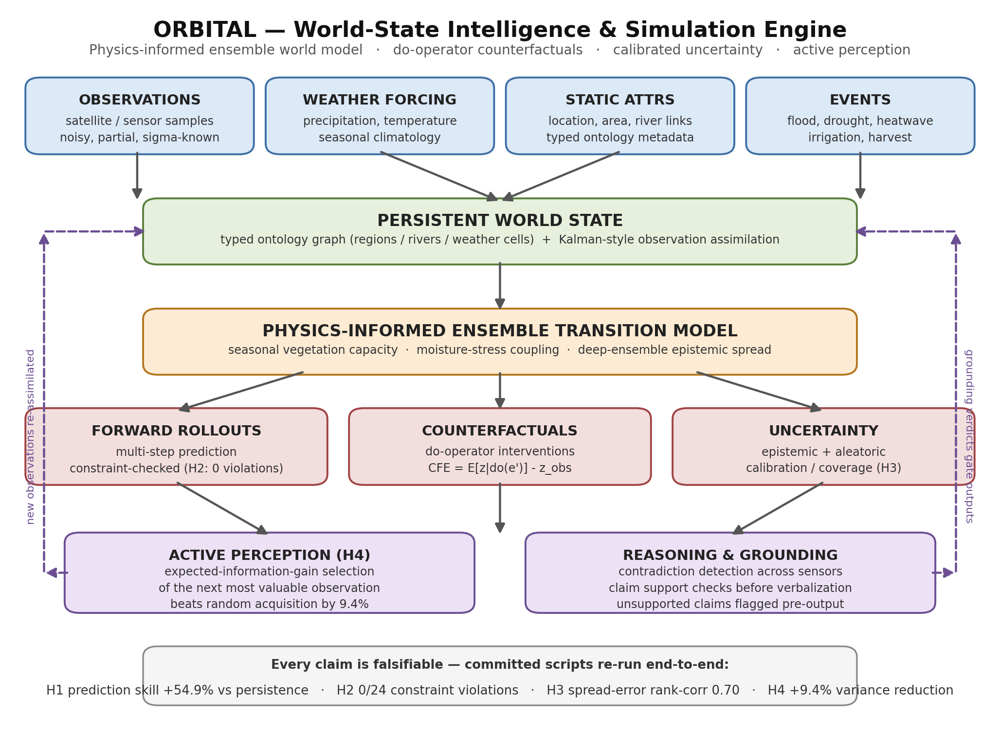
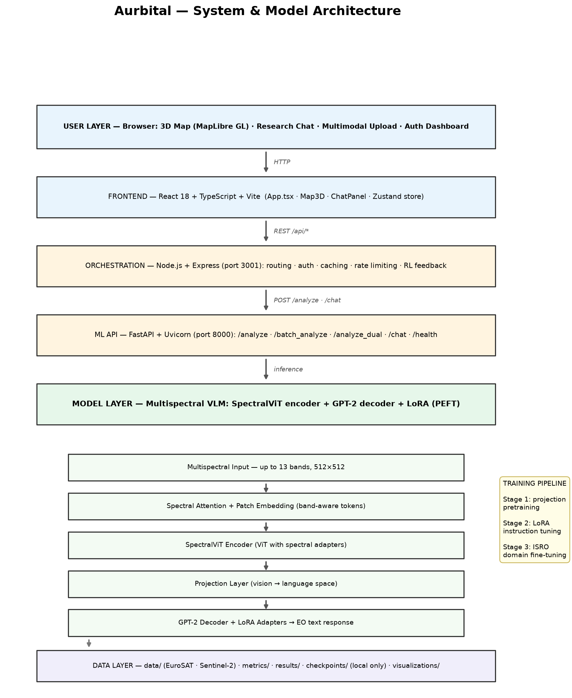
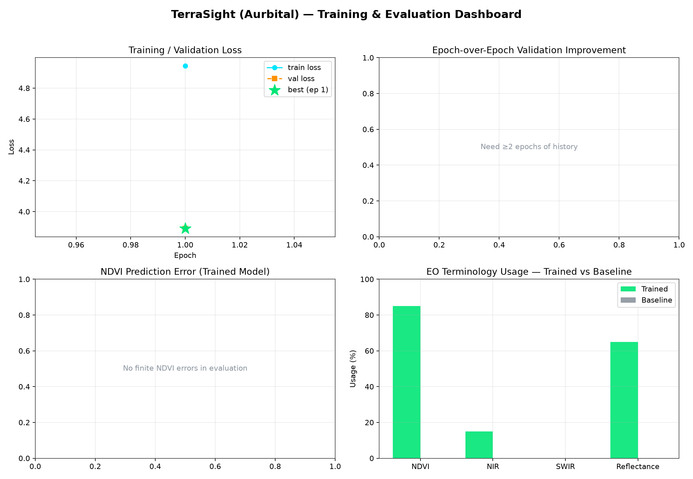

# Aurbital — Multimodal AI for Earth Observation + World-State Research Engine

Aurbital (formerly EarthAware / TerraSight) combines two layers:

| Layer | Name | What it does | Entry point |
|-------|------|--------------|-------------|
| Applied | **TerraSight** | Multispectral Vision-Language Model (SpectralViT + GPT-2 + LoRA) with an interactive 3D map research assistant. Built for ISRO's challenge of enhancing open-source GPT models with multimodal vision for Earth Observation data. | [`earthaware/`](earthaware/) |
| Research | **ORBITAL** | World-State Intelligence & Simulation Engine: a physics-informed ensemble world model with counterfactual simulation, calibrated uncertainty, and active perception. Every claim is backed by a committed, re-runnable experiment. | [`orbital/`](orbital/) |

Live demo: https://aurbital.streamlit.app/

---

## System Architecture

### ORBITAL research engine

### TerraSight applied platform

---

## Results at a Glance

### ORBITAL world model (research layer)

| Hypothesis | Claim | Result | Status |
|------------|-------|--------|--------|
| H1 — Prediction skill | Ensemble world model beats persistence / AR(1) / retrieval | Mean RMSE **0.420 vs 0.930** (persistence) — **+54.9% skill** | Supported |
| H2 — Counterfactual validity | do-operator rollouts respect physical constraints | **0 violations in 24 steps** under do(HEATWAVE) | Supported |
| H3 — Uncertainty quality | Ensemble spread is informative about actual error | Spread-error rank correlation **0.70**; ECE 0.44 to 0.22 after rescaling | Partially supported |
| H4 — Active perception | Info-gain acquisition beats random observation selection | **+9.4%** posterior-variance reduction | Directionally supported |

| Model | ndvi | soil_moisture | temperature | stress | mean RMSE |
|-------|------|---------------|-------------|--------|-----------|
| Persistence | 0.353 | 0.038 | 3.329 | 0.000 | 0.930 |
| AR(1) | 0.454 | 0.016 | 3.045 | 0.006 | 0.880 |
| Retrieval | 0.248 | 0.051 | 4.435 | 0.005 | 1.185 |
| **ORBITAL ensemble** | **0.267** | 0.033 | **1.380** | **0.000** | **0.420** |

### TerraSight vision-language model (applied layer)

| Metric | Trained | Baseline |
|--------|---------|----------|
| NDVI usage in answers | 85.0% | 0.0% |
| NIR usage in answers | 15.0% | 0.0% |
| Reflectance usage in answers | 65.0% | 0.0% |
| NDVI average error | 0.0589 | — |

Full metrics: [`earthaware/research/README.md`](earthaware/research/README.md) and [`experiments/README.md`](experiments/README.md).

---

## Repository Layout

| Path | Contents |
|------|----------|
| [`earthaware/`](earthaware/) | Applied layer: training, evaluation, FastAPI server, Streamlit demo, full-stack web app |
| [`earthaware/visualizations/`](earthaware/visualizations/) | Research-paper charts: metrics dashboard, loss curve, architecture diagram (PNG) |
| [`earthaware/research/`](earthaware/research/) | Metrics tables and evaluation write-ups |
| [`orbital/`](orbital/) | Research layer: ontology, world state, physics ensemble, simulator, discovery, reasoning |
| [`orbital/docs/`](orbital/docs/) | Research problem, mathematical formulation, ontology specification |
| [`experiments/`](experiments/) | Reproducible ORBITAL experiments: scripts, results (JSON), figures (PNG) |
| [`tests/`](tests/) | 11 unit tests enforcing ORBITAL engine invariants |
| [`hf-spaces-demo/`](hf-spaces-demo/) | Production Streamlit app (deployed live) |
| [`docs/`](docs/) | Build, quick-start, deployment, and evaluation guides |
| `dumping/` | Legacy/prototype files kept for reference only |

---

## Reproduce Everything

| Step | Command |
|------|---------|
| Train TerraSight (7 epochs, LoRA, 4 GB VRAM) | `python train_isro_eo_enhanced.py --epochs 7 --batch-size 1 --grad-accum 45 --lr 2e-5 --class-balance --allow-missing-classes` |
| Evaluate on the benchmark | `python day5_evaluate_comprehensive.py` |
| Regenerate TerraSight charts + diagram | `python generate_visualizations.py` |
| Run ORBITAL experiment 1 (H1 + H2) | `python experiments/run_experiment1.py` |
| Run ORBITAL experiment 2 (H3 + H4) | `python experiments/run_experiment2.py` |
| Regenerate ORBITAL architecture diagram | `python orbital/generate_architecture_diagram.py` |
| Run the engine test suite | `python -m unittest tests.test_orbital` |

---

## Supported Satellite Systems

| Satellite | Sensor | Bands | Resolution | Use Case |
|-----------|--------|-------|------------|----------|
| RESOURCESAT | LISS-III | 4 | 23.5 m | Agriculture, forestry, land use |
| RESOURCESAT | LISS-IV | 3 | 5.8 m | High-resolution mapping |
| RESOURCESAT | AWiFS | 4 | 56 m | Wide-area monitoring |
| CARTOSAT | PAN | 1 | 2.5 m | Stereo mapping, DEM |
| RISAT | SAR | 1 | 1 m | All-weather / night imaging |
| Sentinel-2 | MSI | 13 | 10–60 m | Reference multispectral data |

---

## Documentation

| Document | Description |
|----------|-------------|
| [`docs/BUILD_GUIDE.md`](docs/BUILD_GUIDE.md) | Step-by-step build guide |
| [`docs/QUICK_START.md`](docs/QUICK_START.md) | Setup (Colab, local, Docker) |
| [`docs/QUICK_START_WEB.md`](docs/QUICK_START_WEB.md) | Web app quick start |
| [`docs/WEB_APP_SETUP_GUIDE.md`](docs/WEB_APP_SETUP_GUIDE.md) | Detailed web app setup |
| [`docs/evaluation_deployment_guide.md`](docs/evaluation_deployment_guide.md) | Evaluation framework + Docker/K8s |
| [`docs/DEPLOYMENT_STREAMLIT.md`](docs/DEPLOYMENT_STREAMLIT.md) | Live demo deployment |
| [`docs/isro_multimodal_proposal.md`](docs/isro_multimodal_proposal.md) | Original technical proposal |
| [`orbital/docs/research_problem.md`](orbital/docs/research_problem.md) | ORBITAL research question and hypotheses |
| [`orbital/docs/mathematical_formulation.md`](orbital/docs/mathematical_formulation.md) | World-state mathematics |
| [`orbital/docs/ontology.md`](orbital/docs/ontology.md) | Ontology specification |

---

## Notes

- `checkpoints/*.pt` model weights (~1.5 GB) stay local (gitignored); training scripts regenerate them.
- The original TerraSight repository remains intact; this repo is the new home of the project.
- ORBITAL's honest limitation: H3's variance rescaling is currently fitted on the evaluation points; a held-out conformal calibration split is the next milestone.

## Author

**Ved Vivek Talmaley** — [GitHub](https://github.com/VED-VIVEK-TALMALEY)

## License

MIT — see [`LICENSE`](LICENSE).
