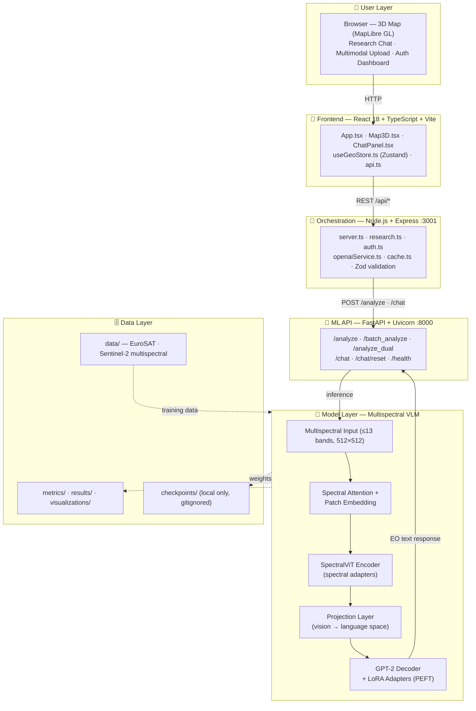
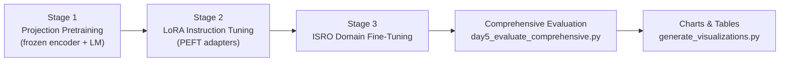

# 🏗️ Architecture Diagram (Mermaid)

Rendered PNG version: [`../visualizations/architecture_diagram.png`](../visualizations/architecture_diagram.png)
Dashboard charts: [`../visualizations/metrics_dashboard.png`](../visualizations/metrics_dashboard.png)

## System & Model Architecture

## Training Pipeline

