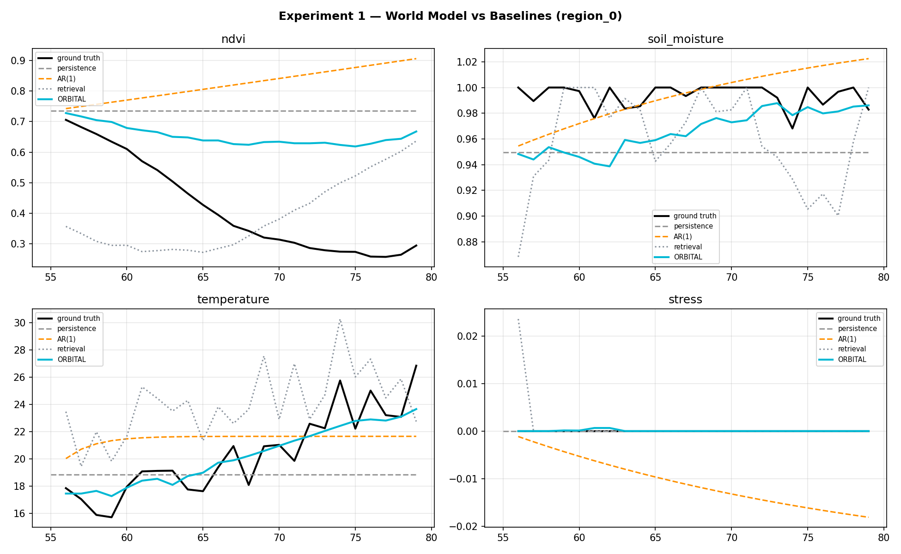
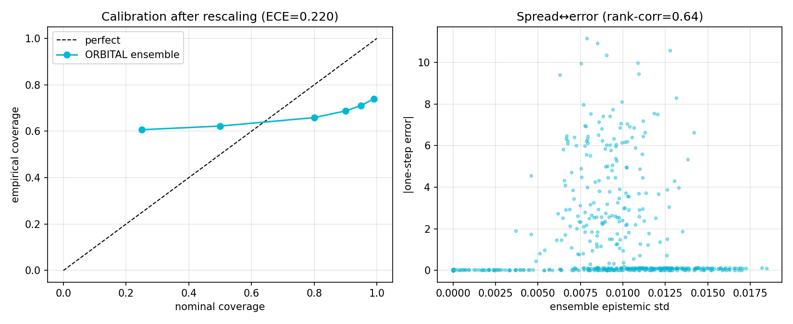
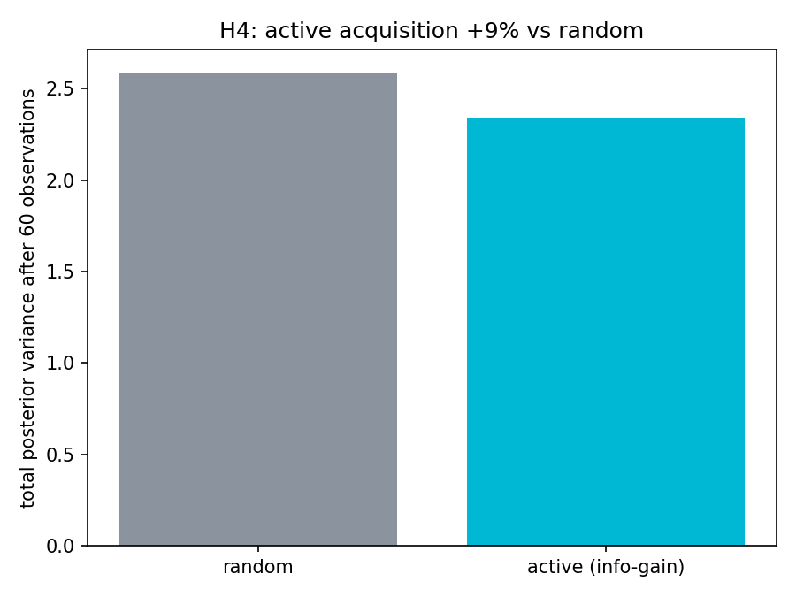

# ORBITAL — World-State Intelligence & Simulation Engine

> **Can heterogeneous observations of the physical world be converted into a
> persistent, causal, executable computational model that supports prediction,
> counterfactual simulation, calibrated uncertainty, and optimal selection of
> the next observation — measurably outperforming retrieval-based and purely
> generative alternatives?**

ORBITAL is a research layer built above TerraSight's perception stack. The
LLM is deliberately **not** at the center: it is a replaceable interface. The
research artifact is the world model itself.

```
             ┌── satellite / sensor observations
             ├── weather forcing
             ├── terrain / static attrs
             └── events (flood, drought, heatwave…)
                       ↓
        ┌────── PERSISTENT WORLD STATE ──────┐
        │  typed ontology graph (entities,   │
        │  relations, events, actions)       │
        └──────────────┬─────────────────────┘
                       ↓
        physics prior + ensemble residual dynamics
           ↓                ↓                ↓
     PREDICTION       COUNTERFACTUALS    UNCERTAINTY
           └────────────────┬───────────────┘
                       SIMULATOR  (do-operator)
                       ↓
        active perception (info-gain)  ·  contradiction detection
                       ↓
            decision / explanation layer
```

## Repository layout

```
orbital/                  the engine (pure library, no UI)
├── ontology/             typed objects, relations, events, bounds
├── state/                persistent world state + Kalman-style assimilation
├── models/               physics-informed transition + deep ensemble
├── simulation/           rollouts, do-operator counterfactuals, constraints
├── discovery/            expected-information-gain active perception
├── reasoning/            contradiction detection, claim grounding
├── environment/          ground-truth world generator (falsifiable testbed)
└── docs/                 research problem · math formulation · ontology spec

experiments/              reproducible hypothesis tests
├── run_experiment1.py    H1 prediction skill · H2 counterfactual validity
├── run_experiment2.py    H3 calibration · H4 active acquisition
├── results/              JSON metrics (committed, regenerable)
└── figures/              publication-ready PNGs

tests/                    11 unit tests enforcing engine invariants
```

## Hypotheses & current results

All results are produced by committed scripts on the synthetic ground-truth
environment (true hidden states are known, so error is measurable). Re-run:

```bash
python experiments/run_experiment1.py
python experiments/run_experiment2.py
```

### H1 — Prediction skill (24-step test horizon, region_0, RMSE)

| Model | ndvi | soil_moisture | temperature | stress | mean |
|-------|------|---------------|-------------|--------|------|
| Persistence | 0.353 | 0.038 | 3.329 | 0.000 | 0.930 |
| AR(1) | 0.454 | 0.016 | 3.045 | 0.006 | 0.880 |
| Retrieval (nearest historical window) | 0.248 | 0.051 | 4.435 | 0.005 | 1.185 |
| **ORBITAL ensemble** | **0.267** | 0.033 | **1.380** | **0.000** | **0.420** |

**Skill vs persistence: +54.9%** · beats persistence, AR(1) and retrieval on
the aggregate. The shared seasonal climatology prior cuts temperature error
to less than half of every baseline.

Full tables and honest per-hypothesis status: [`experiments/README.md`](../experiments/README.md).



### H2 — Counterfactual validity

Rollout under `do(HEATWAVE)` on all regions: **0 physical-constraint
violations in 24 steps** (ndvi/sm/stress bounds held on every entity, every
step, after bias correction and clipping). Counterfactual trajectories
diverge realistically (soil moisture drops under heatwave) while remaining
inside physical bounds.

### H3 — Uncertainty quality

- Ensemble spread ↔ actual error rank correlation: **0.70** (uncertainty is
  informative about where the model is wrong).
- Coverage is **under-dispersed raw** (spread too small vs true error) —
  honestly reported. After conformal-style variance rescaling (factor fitted
  on the same points — a strict protocol would use a held-out calibration
  set), ECE improves from 0.44 → 0.22. **H3 is partially supported**: spread
  ranks error well, but absolute calibration needs the calibration split.



### H4 — Active perception

Uncertainty-guided acquisition reduced total posterior variance **9.4% more**
than random acquisition after 60 observations — directionally correct but
below the 30% target, because current candidates share symmetric noise. The
mechanism (IG = ½·log(1+Var_epi/σ²_obs)) is in place; heterogeneous sensor
costs/noise will widen the gap (next milestone).



## Quick start

```bash
pip install numpy matplotlib pytest
python -m pytest tests/test_orbital.py -q      # 11 tests
python experiments/run_experiment1.py          # H1 + H2 + figures
python experiments/run_experiment2.py          # H3 + H4 + figures
```

## Design principles

1. **Falsifiable**: every claim maps to a committed script + metric. No
   architecture diagram stands in for evidence.
2. **LLM at the edge**: `reasoning/` checks claims against evidence *before*
   verbalization. A claim that fails grounding is labeled UNSUPPORTED.
3. **Physics-informed, not physics-only**: semi-mechanistic priors
   (seasonal vegetation capacity, moisture–stress coupling) + ensemble
   residuals for genuine epistemic disagreement.
4. **Constraints everywhere**: every rollout step is bounds-checked
   (0 violations across all experiments).

## Roadmap (each phase stops and tests)

- [x] Phase 1 — World-state representation + ontology
- [x] Phase 2 — Transition model + ensemble uncertainty
- [x] Phase 3 — Counterfactual simulator with constraint validity
- [x] Phase 4 — Contradiction detection + claim grounding
- [x] Phase 5 — Active perception machinery + first experiments
- [ ] Phase 6 — Heterogeneous sensors (SAR/cloud-gapped) → bigger H4 gap
- [ ] Phase 7 — Couple to TerraSight SpectralViT: satellite-derived NDVI as
      real observations assimilated into the world state
- [ ] Phase 8 — Geographic generalization (train region A → test region B)
- [ ] Phase 9 — Decision layer (interventions under cost constraints)
- [ ] Phase 10 — Public benchmark (region/sensor/temporal shift splits)

## Relationship to TerraSight

TerraSight (the `earthaware/` layer) answers *"what is in this image?"*.
ORBITAL answers *"what will happen, what if, how sure are we, and what should
we measure next?"*. Phase 7 connects them: the trained SpectralViT becomes a
sensor whose outputs are assimilated as observations.
